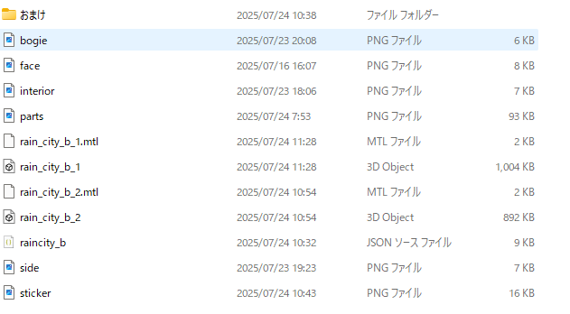
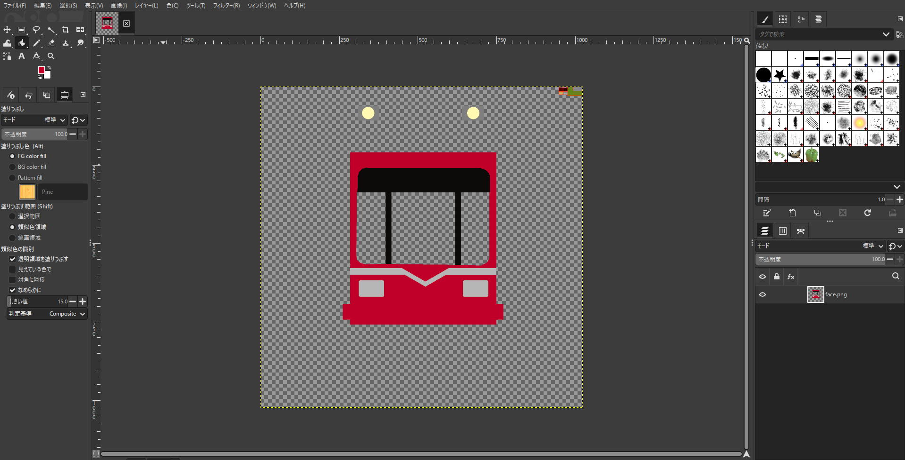
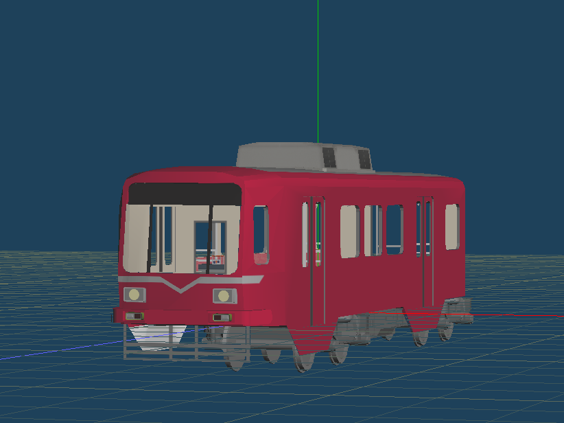
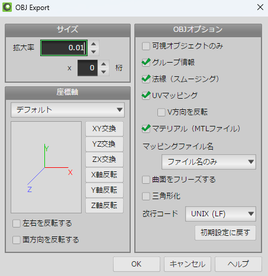
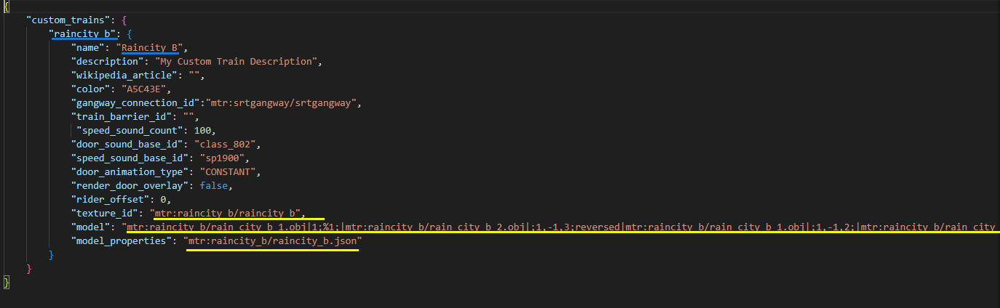
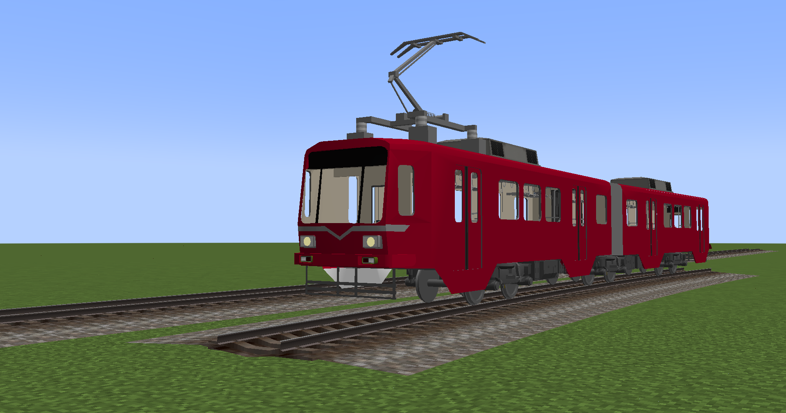

# ほしい車両がない？自炊しようぜ！  

皆さん、MTRやってますか？最近4.0も出て活発になりつつあり、とても嬉しい所存でございます。やってない？**今すぐやりなさい**  
さて、MTRの欠点の一つとして挙げられるのが、車両の少なさ。欧米の車両はそれなりにあるのですが、日本の車両がとにかく少ない。  
このおかげでMTRを使わない！という方もかなり多いのでは無いでしょうか。    
では、作ってみませんか？実はMTRの車両（以下：リソースパックと呼びます）は頑張れば自作することが出来ます。（最も、これはどの鉄道modやシミュレーションゲームにも当てはまりますが）  
もちろん、それなりの覚悟は必要です。リソースパックの制作は一筋縄ではいきません。それでも作りたい！という方はどうぞ。     

# まずはリテクスチャから始めよう
とはいえ、一から作るのはなかなか骨が折れるので、既存のリソースパックのリテクスチャから始めましょう。  
私の作ったリソースパックにLighTRainとRaincityというシリーズがあります。このリソースパック群は改造自由なので、これをベースにリテクスチャしてみましょう。  
もちろん、modrinthで公開されているリソースパックでも可です。  

**リテクスチャするリソースパックの利用規約は必ず確認しましょう。場合によっては禁止されている場合もあります。**

# リテクスチャしてみよう
それでは早速作ってみましょう。  
用意するものはこちら。
- MTRが入ったMinecraftJava版（MTR3の場合はANTEも用意）
- リテクスチャ元のリソースパック
- GIMP  
- Metasequoiaなどのモデリングソフト
- VSCodeなどのテキストエディタ  

一つずつ解説します。1つ目と2つ目は当たり前ですね。  
GIMPはペイントソフトと呼ばれるもので、テクスチャを塗り替えるのに必要です。  
Metasequoiaは実際の見た目を確認するのに使います。今のところモデリングはしないので身構え無くて大丈夫。      
VSCodeはリソースパックのモデルファイルやテクスチャファイルを定義するのに使います。「プログラミングに使うソフトでしょ？難しそう…」と思うかもしれませんが、そんなことないです。    
というかMTRのリソースパック制作では、スクリプトを使わない限り、プログラミングの知識はほぼ必要無いです。  
まず、リソースパックをDLしましょう。今回は佳作、Raincity BのMTR3版を使います。  
そしたらファイルを解凍して、中身を覗いてみましょう。テクスチャファイルとモデルファイルはassets/mtr/raincity_bにあります。  

・・・おや？「おまけ」と書かれたフォルダがありますね。実はこの中にはMetasequoiaで取り扱えるファイルの.mqozが入っています。  
これはひとまず置いといて、まずはテクスチャファイルをGIMPで開きましょう。  
assets/mtr/raincity_bをコピペして好きな名前にリネーム。（注意：ファイル名には半角英小文字、英数字しか使えません）GIMPを起動して、コピペしたテクスチャファイルを画面上に放り込めば開けます。  
(GIMPの詳しい使い方については、ここでは解説しません。)  
今回は名鉄スカーレット塗装に塗ってみましょうかね。  

塗り終えたらMetasequoiaで確認してみましょう。ここでさっき登場した.mqozファイルが活躍します。  
このとき、おまけフォルダからraincity_bに.mqozファイルを移動させてください。

開いてみるとこんな感じ。なかなかよさげですね。  
そしたら、.objファイルに出力します。MTRの仕様上、.objファイルしか取り扱えないからです。  

出力設定はこんな感じで。  
出力が出来たら、assets/mtrにあるmtr_custom_resourcesというファイルを開きます。ここでVScodeが登場します。  

青色のところを好きな名前に、黄色のところをリテクスチャしたモデルのファイル名にしてください。
そして、このファイルをminecraftで起動してみましょう。

このように表示されれば完成です！お疲れ様でした。  
表示されない場合はファイルのパスが間違ってないか、もう一度確認してみましょう。  
リテクスチャだけでも、遊べる幅はぐんと上がります。慣れてきたら、いよいよ自炊へ踏み入れましょう。