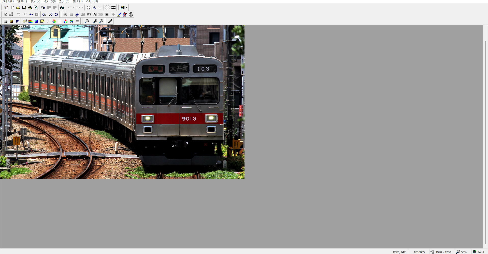
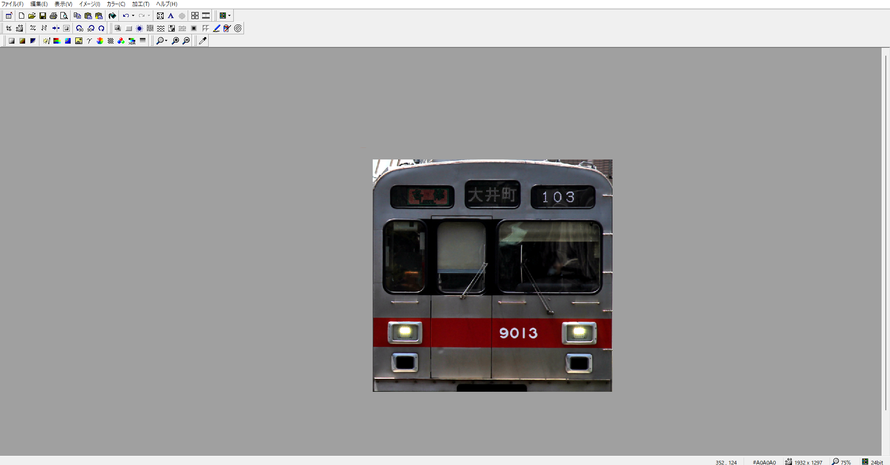
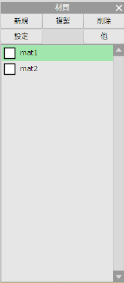
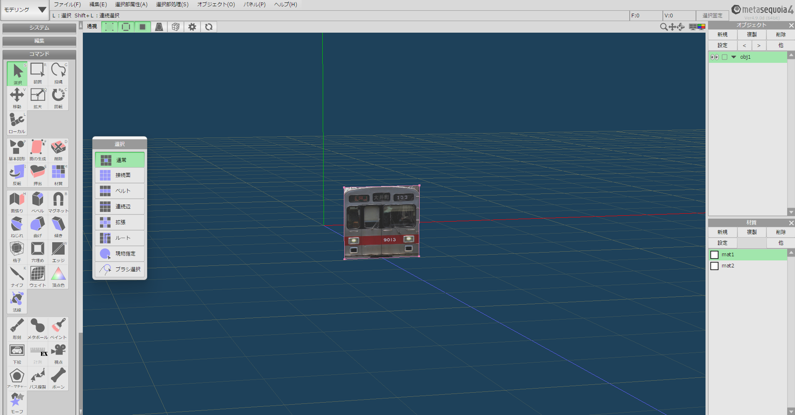
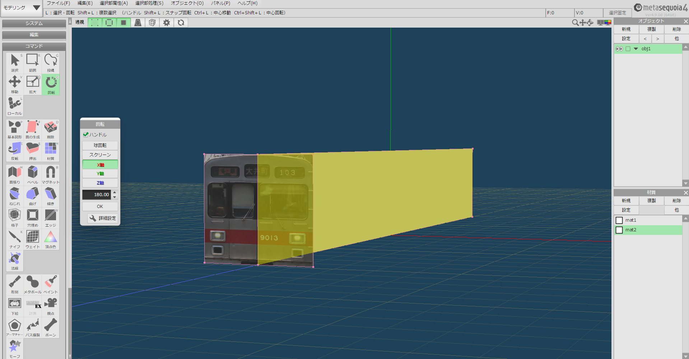

# 用意するもの
さて、いよいよ自炊です。用意するものはこちら。  
- MTRが入ったMinecraftJava版（MTR3の場合はANTEも用意）
- リテクスチャ元のリソースパック
- GIMP  
- Metasequoiaなどのモデリングソフト
- VSCodeなどのテキストエディタ  
- JTrim  
- （必要であれば）goghなどの作業用アプリ、またはラジオ  
といってもリテクスチャするときとさほど変わりません。増えたものだけ解説すると、JTrimは画像を切り抜くのに使います。  
gogh、ラジオはなんで必要なの？と思うかもしれません。実はこれ、結構重要でして・・・  
というのもモデリング作業、かなり集中力を必要とします。そのため、作業用BGMがあったほうがいいということもよくあります。  
goghはいい感じのチルい音楽を流してくれる他、ポモドーロタイマーも備わっているため、適度な休憩を取れるというメリットがあります。  
ただ、有料ソフトですので、おサイフとご相談を。（そんなに高くないけどね）  
ラジオはFMがおすすめです。音楽をたくさん流してくれるので。  
# 下ごしらえ
ではまず、作業用フォルダを作りましょう。今回は東急9000系を作るので、東急9000系というフォルダを作成。  
その中に資料フォルダを作ってやります。この中に資料写真を入れておきます。  
次に、お顔の写真を切り取ります。JTrimでお顔の写真を開きます。（今回お顔の写真は写真ACからお借りしました。）  

そしたら大まかに切り取ります。(切り取り方は左クリックをクリックしながら切り抜きたい部分を選択)  
画像は傾いていることもあるので、任意角度回転などで調整しましょう。  

このように切り取れたら保存します。  
そしたらMetasequiaを起動して、材質を2つ用意します。  
お顔と側面のテクスチャをそれぞれに割り当てるためです。  

次に切り抜いた写真を貼り付ける板を作ります。  
ここで車体の幅が必要になりますのでwikipediaなどで調べましょう。  
wikipediaによると280cmらしいので、280cmで。
高さは260cmがちょうど良いでしょう。  
位置は長さが19.5Mなので割る2してZ軸975cmで。

こんな感じで作ったら、同じように側面の板も作りましょう。（同じような作業なので割愛します。）  

（側面の画像は諸事情により非表示にしています。）  
ここまで出来たら下ごしらえ完了です。  
一旦保存しましょう。